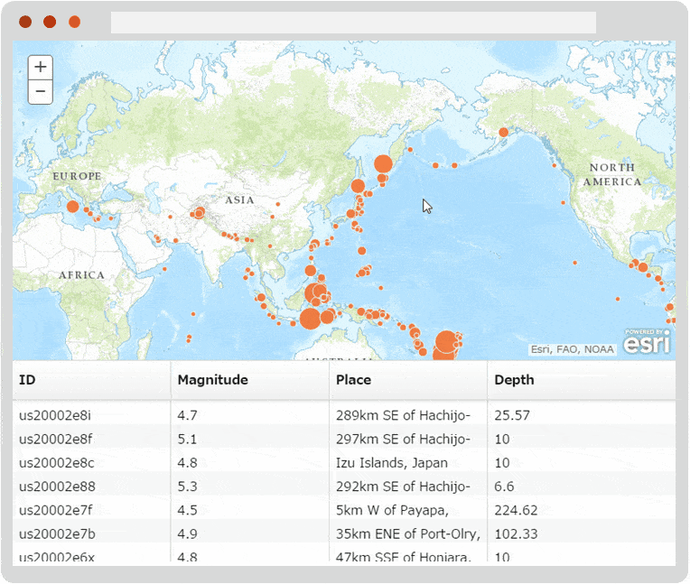

# ArcGIS API for JavaScript with React JS

[Esri JS](https://developers.arcgis.com/javascript/) apps with [React](https://facebook.github.io/react/index.html) for sample.

* [esri-fixed-data-table (JSX)](https://ynunokawa.github.io/esri-react-js/esri-fixed-data-table/)

